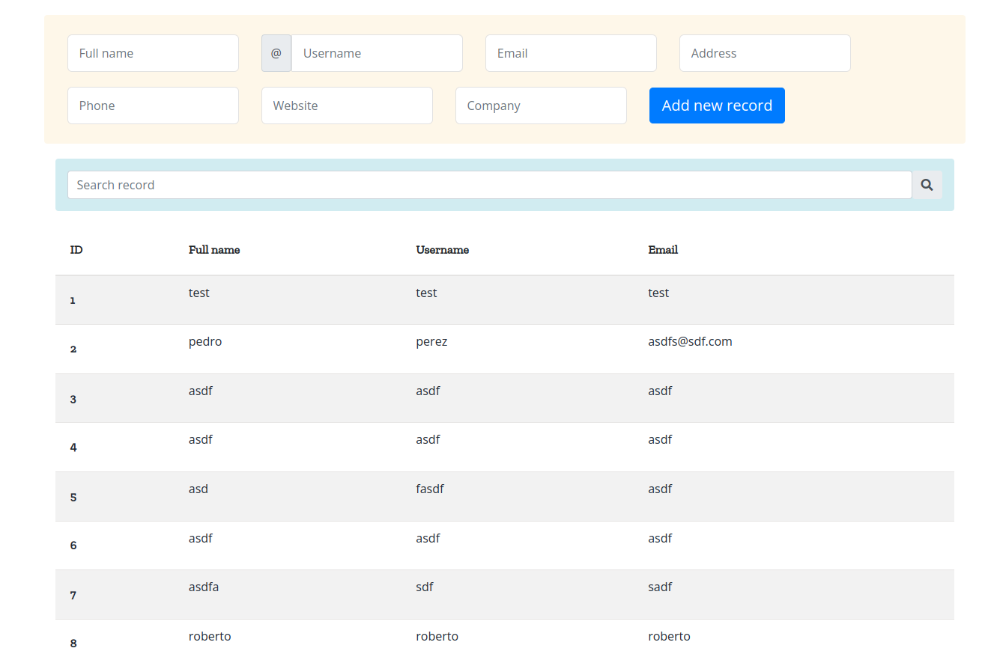
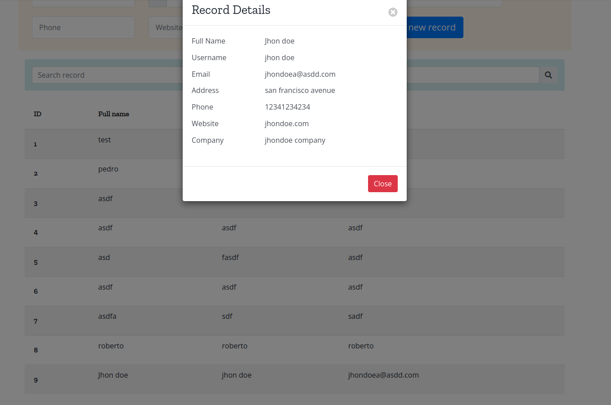
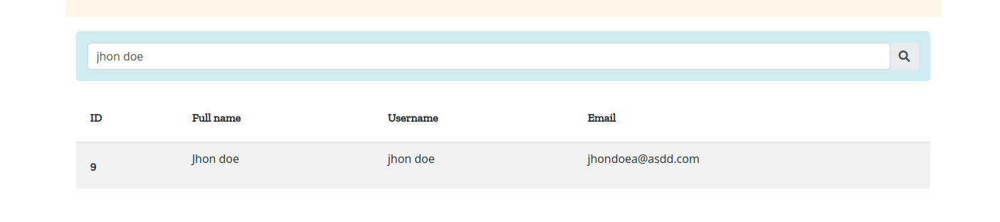

## Installation ## 

Plugin ZIP file can be [**downloaded**](https://github.com/Softdiscover/wp-simple-form/zipball/master)  

To install, Please follow the steps below: 

= Via backend of WordPress =
1. After your download the zip file, log into backend of your WordPress 
2. Go to Plugins > Add New
3. Click the Upload link
4. Click Browse and locate the file that you downloaded and click *Install Now*
5. After Wordpress has finished unpacking the file click on *Activate Plugin*

## How to use ## 
Create a page or post, then add the two next shortcodes to create records and show data: 
```bash
[my_form]

[my_list]
```

then on frontend, a form and records list will be loaded. if there are no records, it will load empty.



add a new record and press Add new record button
 


the new record will appear at the bottom
 


you can get more details clicking on any info, then a modal will be shown with all details of the record



additionally, you can search a record by a keyword, and the record will be shown in the table.


 